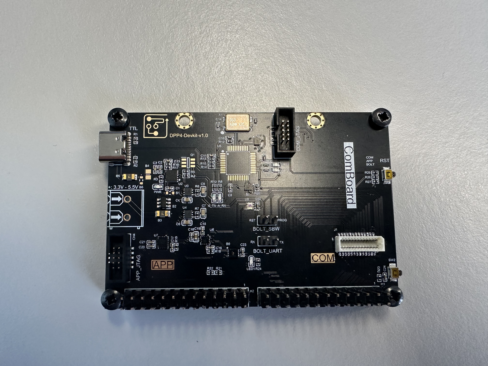

# dpp4-devkit

This is the 4.version of a dual-processor development board designed for [Prof. Gomez](https://andresgomez.ch/web/contact/) at TU Braunschweig. It is widely used in PhD-level research and master theses, and has already been procured in large quantities.

    

